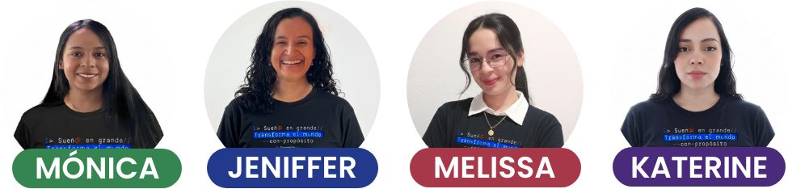
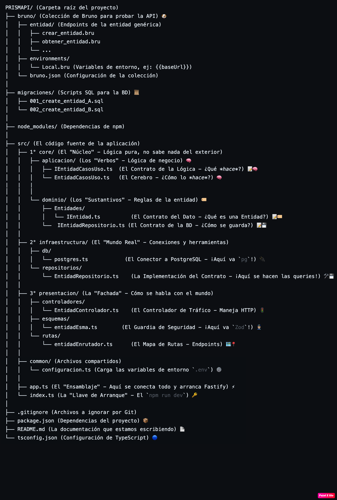
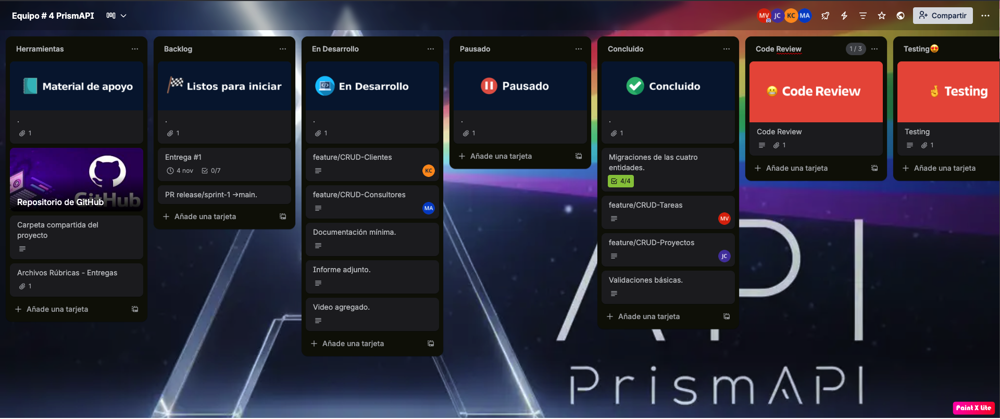

# 📊 Informe de Implementación y Avances: PrismAPI

## 1. Introducción

> ¿Cuántos proyectos no avanzan por crisis organizacionales?
> ¿Cuántas ideas brillantes no se consolidan por problemas de comunicación y seguimiento?

**PrismAPI** surge para dar respuesta a estas preguntas. Un proyecto tiene múltiples aspectos que deben manejarse con total claridad: **tareas, clientes y consultores**.

Nuestra meta es transformar los datos de un proyecto en información útil, permitiendo una visibilidad total y en tiempo real del estado del mismo. A futuro, esta base permitirá integrar módulos más complejos como la gestión de **tiempos, recursos y presupuestos**.

---

## 2. Misión, Visión y Valores

### Misión
Conectar ideas, equipos y herramientas a través de un sistema que asegure la entrega exitosa de resultados, **facilitando la trazabilidad de las tareas y sus responsables**, y permitiendo a los usuarios centrarse en ejecutar sus ideas.

### Visión
Ser líderes en la transformación de la gestión de proyectos, ofreciendo a los usuarios un servicio **flexible y ágil** que promueva una organización integrada, alineada con sus objetivos estratégicos e impulsando la innovación en el país.

### Valores
* **Claridad:** Visibilidad total en cada etapa.
* **Colaboración:** Fomentar la comunicación entre equipos.
* **Innovación:** Buscar siempre la forma más eficiente de gestionar.
* **Ejecución con propósito:** Ayudar a que las ideas se conviertan en realidad.

---

## 3. Nuestro Equipo de Desarrollo 👩‍💻

| | |
| :---: | :---: |
| **Mónica Lizeth Calvo** *Ingeniera Industrial \| Desarrolladora Backend* | **Jeniffer Caballero** *Ingeniera Química \| Desarrolladora Backend* |
| **Melissa Martinez** *Administradora de Empresas* *Ingeniera Industrial \| Desarrolladora Backend* | **Katerine Henao** *Comunicadora Gráfica Publicitaria \| Desarrolladora Backend* |

## 4. Decisiones Técnicas y Arquitectura

### Stack Tecnológico

* **Fastify:** Elegimos este framework por su alta velocidad, bajo *overhead* (coste computacional) y una arquitectura moderna orientada al máximo rendimiento.
* **PostgreSQL:** Optamos por "Postgres" debido a la naturaleza relacional compleja de nuestro dominio. Un proyecto tiene tareas, que se ligan a clientes, que a su vez tienen usuarios, etc.
* **Zod:** Usamos Zod para el parseo y validación de esquemas. Asegura que los datos que entran y salen de nuestra API sean exactamente lo esperado, con el beneficio de una integración perfecta con TypeScript para generar tipos estáticos.

### Arquitectura

La arquitectura del proyecto está fuertemente inspirada en los principios de **Arquitectura Limpia (Hexagonal)**. El esquema que vimos en clase define tres capas centrales: **Dominio, Aplicación e Infraestructura**, y nuestra estructura sigue este principio.

La diferencia clave es que hemos hecho explícitas las dos caras de la "Capa de Infraestructura":

1.  **Infraestructura de Salida (la Base de Datos):** Aquí es donde aplicamos la simplificación de "Puertos y Adaptadores".
    * **El Puerto:** Es el contrato o interfaz (ej. `ITareasRepositorio.ts`) que vive en el `core` y define *qué* se debe hacer (ej: "guardar tarea").
    * **El Adaptador:** Es la clase concreta (ej. `TareasRepositorio.ts`) que vive en `infraestructura` e implementa ese contrato, usando `pg` para *cómo* hacerlo (ej: `INSERT INTO...`).

2.  **Infraestructura de Entrada (la API Web):** Es la capa que llamamos `presentacion` (controladores, rutas, esquemas Zod). Este es el "adaptador" que recibe las peticiones del mundo exterior (HTTP) y las traduce a comandos que la capa de `aplicacion` puede entender.

Esta arquitectura se caracteriza por:
* **Independencia de frameworks:** El `core` (nuestra lógica de negocio) no sabe que existe Fastify o pg.
* **Dependencia de Abstracciones:** Cada capa depende de interfaces (contratos), no de implementaciones concretas.
* **Responsabilidad Única:** Cada carpeta tiene un propósito claro.
* **Mantenibilidad:** Los desarrolladores pueden trabajar en capas diferentes sin entrar en conflicto y es fácil entender dónde va cada pieza de código.

Para ilustrar esta separación de responsabilidades, a continuación se presenta el esquema de directorios del proyecto:

``

``
## 5. Gestión de Tareas y Avances (Sprints)

El trabajo del equipo se organizará en 4 sprints, uno por semana, con el objetivo de completar la totalidad de los entregables. Esta metodología busca facilitar el seguimiento de los avances en las tareas asignadas, permitir actualizaciones constantes entre los miembros del equipo y asegurar el cumplimiento exitoso de lo propuesto.

La distribución de las tareas por sprint será la siguiente:

| # Sprint | Scrum Master | Fechas (Entrega) | Tareas / Entregables |
| :--- | :--- | :--- | :--- |
| **1** | Mónica | Noviembre 4, 2025 | **Entrega 1:** CRUD de cuatro entidades principales. |
| **2** | Jeniffer | Noviembre 11, 2025 | **Entrega 2:** [Añadir entregable] |
| **3** | Kate | Noviembre 17, 2025 | **Entrega 3:** [Añadir entregable] |
| **4** | Melissa | Noviembre 24, 2025 | **Entrega 4:** [Añadir entregable] |

---

## 6. Metodología de Trabajo y Colaboración

### Roles del equipo

Para el desarrollo de este proyecto, se definieron dos roles principales para garantizar una organización eficiente:

#### 1. Scrum Master (Rol Rotativo)
El rol de Scrum Master será desempeñado de manera rotativa entre los miembros del equipo, cambiando cada semana. La persona que asuma esta responsabilidad será la encargada de:

* Facilitar las reuniones diarias de seguimiento (*daily stand-up*).
* Asegurar el cumplimiento de las metodologías ágiles dentro del equipo.
* Identificar y eliminar impedimentos que puedan afectar el progreso del sprint.
* Coordinar la comunicación entre los miembros del equipo.
* Apoyar la revisión y retrospectiva al finalizar cada sprint.
* Hacer seguimiento y actualizar la herramienta de gestión de proyectos (Trello).
* Hacer entrega de las tareas correspondientes en las plataformas designadas, cumpliendo con los plazos establecidos.

#### 2. Equipo de Desarrollo
El equipo de desarrollo estará compuesto por todos los integrantes y será responsable de la implementación de las funcionalidades. Sus responsabilidades incluyen:

* Diseñar y desarrollar las funcionalidades definidas en el *backlog*.
* Colaborar en la definición de tareas y estimación de esfuerzo.
* Implementar buenas prácticas de desarrollo y revisión de código.
* Realizar pruebas y validación de las funcionalidades desarrolladas.
* Participar activamente en las reuniones diarias y retrospectivas.

### Coordinación y Seguimiento

> **Herramienta de Gestión:** El equipo utilizará **[Trello]([https://trello.com/invite/b/6807ada313d4b9efcd9b3151/ATTI13d541eda55e25388910c2c828a28b0b239AD1F3/equipo-4-prismapi])** como herramienta central de gestión de proyectos para visualizar y dar seguimiento a las tareas y entregables. El Scrum Master será el responsable de mantener actualizada esta plataforma.

Para gestionar nuestro flujo de trabajo, el tablero se organizó en las siguientes columnas clave que representan el ciclo de vida de una tarea:

* **Herramientas:** Contiene recursos fijos como el repositorio de GitHub y material de apoyo.
* **Backlog:** Aquí se listan todas las tareas pendientes y requisitos listos para iniciar.
* **En Desarrollo:** Tareas que están siendo codificadas activamente por un miembro del equipo.
* **Pausado:** Tareas que están bloqueadas o en espera.
* **Concluido:** Tareas que han sido terminadas y validadas.
* **Design / Code Review / Testing:** Columnas específicas para asegurar la calidad de la entrega, gestionando el diseño, la revisión de código y las pruebas de forma independiente.

A continuación, se puede ver una captura de nuestro tablero de Trello en acción durante el Sprint 1:

### Rituales (Dailys)
Para la comunicación y seguimiento diario se establecieron los siguientes canales:

* **Canal de Comunicación Principal:** WhatsApp.
* **Reuniones Diarias (Dailys):** Se realizarán por Google Meet, programadas de 8:00 a 9:00 a.m. Todos los miembros deben asistir para alinear el trabajo y resolver dificultades.

---

### Estrategia de Ramas (Git)

Para el control de versiones usando Git y GitHub, se estableció un flujo de trabajo claro:

#### Flujo de Ramas (Branching Flow)
* `main`: Rama de producción. Nadie hace *push* directo, solo se integra mediante *Pull Requests* aprobados. Todo lo que está aquí funciona.
* `develop`: Rama de integración (equivale a nuestro *release/sprint*). Todas las nuevas *features* parten de esta rama.
* `feature/nombre-feature`: Ramas de funcionalidad (ej. `feature/crud-entidad`). Cada integrante del equipo trabaja en su propia rama de *feature*.

#### Convención de Commits
Se utiliza una convención semántica para los mensajes de los commits:
* `feat(capa): funcionalidad agregada` (Ej: `feat(core): agrega caso de uso de crear entidad`)
* `fix(capa): corrección de bug` (Ej: `fix(infra): corrige query en repositorio de entidad`)
