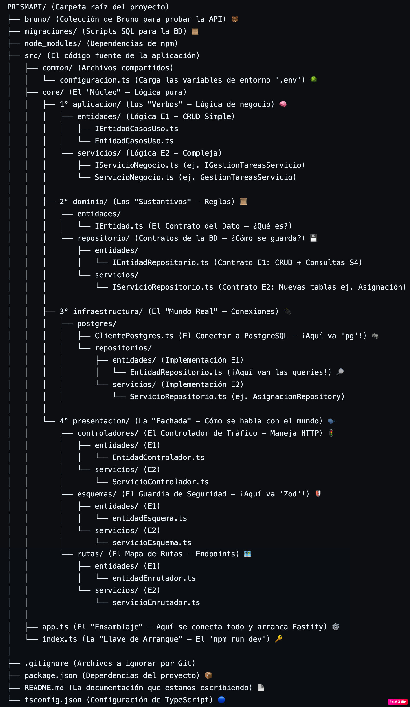
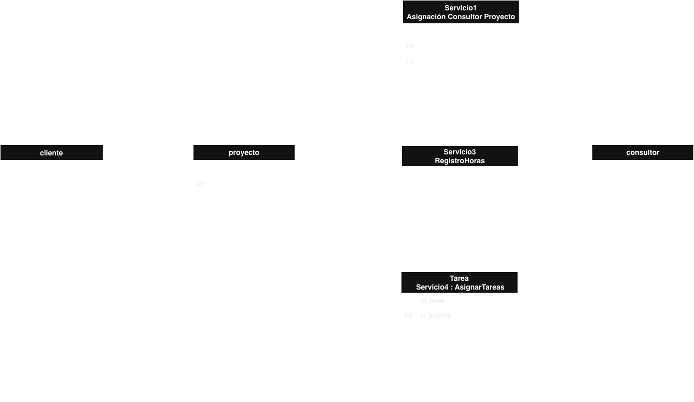

# 📊 Informe de Implementación y Avances: PrismAPI

## Tabla de Contenidos

1. [Introducción](#1-introducción)
2. [Misión, Visión y Valores](#2-misión-visión-y-valores)
   - [Misión](#misión)
   - [Visión](#visión)
   - [Valores](#valores)
3. [Nuestro Equipo de Desarrollo](#3-nuestro-equipo-de-desarrollo-)
4. [Decisiones Técnicas y Arquitectura](#4-decisiones-técnicas-y-arquitectura)
   - [Stack Tecnológico](#stack-tecnológico)
   - [Arquitectura](#arquitectura)
   - [Principios de Clean Code](#principios-de-clean-code)
5. [Gestión de Tareas y Avances (Sprints)](#5-gestión-de-tareas-y-avances-sprints)
6. [Metodología de Trabajo y Colaboración](#6-metodología-de-trabajo-y-colaboración)
   - [Roles del equipo](#roles-del-equipo)
   - [Coordinación y Seguimiento](#coordinación-y-seguimiento)
   - [Rituales (Dailys)](#rituales-dailys)
   - [Estrategia de Ramas (Git)](#estrategia-de-ramas-git)
7. [Evolución de la Arquitectura](#7-evolución-de-la-arquitectura)
   - [Decisión de Arquitectura: Separación de Lógica de Servicio](#decisión-de-arquitectura-separación-de-lógica-de-servicio)
   - [Diagrama de Entidad-Relación (E2)](#diagrama-de-entidad-relación-e2)
   - [Implementación de Servicios (E2)](#implementación-de-servicios-e2)
     - [Servicio 1: Gestión de Asignación de Consultores](#servicio-1-gestión-de-asignación-de-consultores)
     - [Servicio 2: Consulta de Proyectos por Cliente](#servicio-2-consulta-de-proyectos-por-cliente)
     - [Servicio 3: Registro y Control de Horas](#servicio-3-registro-y-control-de-horas)
     - [Servicio 4: Gestión de Tareas de Proyecto](#servicio-4-gestión-de-tareas-de-proyecto)

---

## 1. Introducción

> ¿Cuántos proyectos no avanzan por crisis organizacionales?
> ¿Cuántas ideas brillantes no se consolidan por problemas de comunicación y seguimiento?

**PrismAPI** surge para dar respuesta a estas preguntas. Un proyecto tiene múltiples aspectos que deben manejarse con total claridad: **tareas, clientes y consultores**.

Nuestra meta es transformar los datos de un proyecto en información útil, permitiendo una visibilidad total y en tiempo real del estado del mismo. A futuro, esta base permitirá integrar módulos más complejos como la gestión de **tiempos, recursos y presupuestos**.

---

## 2. Misión, Visión y Valores

### Misión
Conectar ideas, equipos y herramientas a través de un sistema que asegure la entrega exitosa de resultados, **facilitando la trazabilidad de las tareas y sus responsables**, y permitiendo a los usuarios centrarse en ejecutar sus ideas.

### Visión
Ser líderes en la transformación de la gestión de proyectos, ofreciendo a los usuarios un servicio **flexible y ágil** que promueva una organización integrada, alineada con sus objetivos estratégicos e impulsando la innovación en el país.

### Valores
* **Claridad:** Visibilidad total en cada etapa.
* **Colaboración:** Fomentar la comunicación entre equipos.
* **Innovación:** Buscar siempre la forma más eficiente de gestionar.
* **Ejecución con propósito:** Ayudar a que las ideas se conviertan en realidad.

---

## 3. Nuestro Equipo de Desarrollo 👩‍💻

| | |
| :---: | :---: |
| **Mónica Lizeth Calvo** *Ingeniera Industrial \| Desarrolladora Backend* | **Jeniffer Caballero** *Ingeniera Química \| Desarrolladora Backend* |
| **Melissa Martinez** *Ingeniera Industrial \| Desarrolladora Backend* | **Katerine Henao** *Comunicadora Gráfica Publicitaria \| Desarrolladora Backend* |

## 4. Decisiones Técnicas y Arquitectura

### Stack Tecnológico

* **Fastify:** Elegimos este framework por su alta velocidad, bajo *overhead* (coste computacional) y una arquitectura moderna orientada al máximo rendimiento.
* **PostgreSQL:** Optamos por "Postgres" debido a la naturaleza relacional compleja de nuestro dominio. Un proyecto tiene tareas, que se ligan a clientes, que a su vez tienen usuarios, etc.
* **Zod:** Usamos Zod para el parseo y validación de esquemas. Asegura que los datos que entran y salen de nuestra API sean exactamente lo esperado, con el beneficio de una integración perfecta con TypeScript para generar tipos estáticos.

### Arquitectura

La arquitectura del proyecto está fuertemente inspirada en los principios de **Arquitectura Limpia (Hexagonal)**. El esquema que vimos en clase define tres capas centrales: **Dominio, Aplicación e Infraestructura**, y nuestra estructura sigue este principio.

La diferencia clave es que hemos hecho explícitas las dos caras de la "Capa de Infraestructura":

1.  **Infraestructura de Salida (la Base de Datos):** Aquí es donde aplicamos la simplificación de "Puertos y Adaptadores".
    * **El Puerto:** Es el contrato o interfaz (ej. `ITareasRepositorio.ts`) que vive en el `core` y define *qué* se debe hacer (ej: "guardar tarea").
    * **El Adaptador:** Es la clase concreta (ej. `TareasRepositorio.ts`) que vive en `infraestructura` e implementa ese contrato, usando `pg` para *cómo* hacerlo (ej: `INSERT INTO...`).

2.  **Infraestructura de Entrada (la API Web):** Es la capa que llamamos `presentacion` (controladores, rutas, esquemas Zod). Este es el "adaptador" que recibe las peticiones del mundo exterior (HTTP) y las traduce a comandos que la capa de `aplicacion` puede entender.

Esta arquitectura se caracteriza por:
* **Independencia de frameworks:** El `core` (nuestra lógica de negocio) no sabe que existe Fastify o pg.
* **Dependencia de Abstracciones:** Cada capa depende de interfaces (contratos), no de implementaciones concretas.
* **Responsabilidad Única:** Cada carpeta tiene un propósito claro.
* **Mantenibilidad:** Los desarrolladores pueden trabajar en capas diferentes sin entrar en conflicto y es fácil entender dónde va cada pieza de código.
### Principios de Clean Code

Además de la estructura arquitectónica, el equipo se comprometió a seguir los principios de **Clean Code** en la medida de lo posible. Esto se traduce en:

* **Nombres Significativos:** Usar nombres de variables, funciones y clases que revelen su intención (ej. `TareaCasosUso` en lugar de `ManagerT`).
* **Funciones Pequeñas:** Crear funciones que hagan una sola cosa (Principio de Responsabilidad Única a nivel de función).
* **Evitar Repetir Código (DRY):** Reutilizar lógica (como la `configuracion.ts`) en lugar de copiar y pegar.
* **Comentarios Claros:** Usar comentarios solo donde es necesario para explicar el "por qué" de una lógica compleja, no el "qué".

## 5. Gestión de Tareas y Avances (Sprints)

El trabajo del equipo se organizará en 4 sprints, uno por semana, con el objetivo de completar la totalidad de los entregables. Esta metodología busca facilitar el seguimiento de los avances en las tareas asignadas, permitir actualizaciones constantes entre los miembros del equipo y asegurar el cumplimiento exitoso de lo propuesto.

La distribución de las tareas por sprint será la siguiente:

| # Sprint | Scrum Master | Fechas (Entrega) | Tareas / Entregables |
| :--- | :--- | :--- | :--- |
| **1** | Mónica | Noviembre 4, 2025 | **Entrega 1:** CRUD de cuatro entidades principales. |
| **2** | Jeniffer | Noviembre 12, 2025 | **Entrega 2:** Servicios de negocio |
| **3** | Kate | Noviembre 17, 2025 | **Entrega 3:** Pruebas unitarias y de Integración|
| **4** | Melissa | Noviembre 24, 2025 | **Entrega 4:** Presentación Proyecto|

---

## 6. Metodología de Trabajo y Colaboración

### Roles del equipo

Para el desarrollo de este proyecto, se definieron dos roles principales para garantizar una organización eficiente:

#### 1. Scrum Master (Rol Rotativo)
El rol de Scrum Master será desempeñado de manera rotativa entre los miembros del equipo, cambiando cada semana. La persona que asuma esta responsabilidad será la encargada de:

* Facilitar las reuniones diarias de seguimiento (*daily stand-up*).
* Asegurar el cumplimiento de las metodologías ágiles dentro del equipo.
* Identificar y eliminar impedimentos que puedan afectar el progreso del sprint.
* Coordinar la comunicación entre los miembros del equipo.
* Apoyar la revisión y retrospectiva al finalizar cada sprint.
* Hacer seguimiento y actualizar la herramienta de gestión de proyectos (Trello).
* Hacer entrega de las tareas correspondientes en las plataformas designadas, cumpliendo con los plazos establecidos.

#### 2. Equipo de Desarrollo
El equipo de desarrollo estará compuesto por todos los integrantes y será responsable de la implementación de las funcionalidades. Sus responsabilidades incluyen:

* Diseñar y desarrollar las funcionalidades definidas en el *backlog*.
* Colaborar en la definición de tareas y estimación de esfuerzo.
* Implementar buenas prácticas de desarrollo y revisión de código.
* Realizar pruebas y validación de las funcionalidades desarrolladas.
* Participar activamente en las reuniones diarias y retrospectivas.

### Coordinación y Seguimiento

> **Herramienta de Gestión:** El equipo utilizará **[Trello]([https://trello.com/invite/b/6807ada313d4b9efcd9b3151/ATTI13d541eda55e25388910c2c828a28b0b239AD1F3/equipo-4-prismapi])** como herramienta central de gestión de proyectos para visualizar y dar seguimiento a las tareas y entregables. El Scrum Master será el responsable de mantener actualizada esta plataforma.

Para gestionar nuestro flujo de trabajo, el tablero se organizó en las siguientes columnas clave que representan el ciclo de vida de una tarea:

* **Herramientas:** Contiene recursos fijos como el repositorio de GitHub y material de apoyo.
* **Backlog:** Aquí se listan todas las tareas pendientes y requisitos listos para iniciar.
* **En Desarrollo:** Tareas que están siendo codificadas activamente por un miembro del equipo.
* **Pausado:** Tareas que están bloqueadas o en espera.
* **Concluido:** Tareas que han sido terminadas y validadas.
* **Design / Code Review / Testing:** Columnas específicas para asegurar la calidad de la entrega, gestionando el diseño, la revisión de código y las pruebas de forma independiente.

A continuación, se puede ver una captura de nuestro tablero de Trello en acción durante el Sprint 1:

### Rituales (Dailys)
Para la comunicación y seguimiento diario se establecieron los siguientes canales:

* **Canal de Comunicación Principal:** WhatsApp.
* **Reuniones Diarias (Dailys):** Se realizarán por Google Meet, programadas de 8:00 a 9:00 a.m. Todos los miembros deben asistir para alinear el trabajo y resolver dificultades.

---

### Estrategia de Ramas (Git)

Para el control de versiones usando Git y GitHub, se estableció un flujo de trabajo claro:

#### Flujo de Ramas (Branching Flow)
* `main`: Rama de producción. Nadie hace *push* directo, solo se integra mediante *Pull Requests* aprobados. Todo lo que está aquí funciona.
* `develop`: Rama de integración (equivale a nuestro *release/sprint*). Todas las nuevas *features* parten de esta rama.
* `feature/nombre-feature`: Ramas de funcionalidad (ej. `feature/crud-entidad`). Cada integrante del equipo trabaja en su propia rama de *feature*.

#### Convención de Commits
Se utiliza una convención semántica para los mensajes de los commits:
* `feat(capa): funcionalidad agregada` (Ej: `feat(core): agrega caso de uso de crear entidad`)
* `fix(capa): corrección de bug` (Ej: `fix(infra): corrige query en repositorio de entidad`)
Se utiliza una convención semántica para los mensajes de los commits:
* `feat(capa): funcionalidad agregada` (Ej: `feat(core): agrega caso de uso de crear entidad`)
* `fix(capa): corrección de bug` (Ej: `fix(infra): corrige query en repositorio de entidad`)

---

## 7. Evolución de la Arquitectura 

Para la Entrega 2, el reto principal fue integrar cuatro nuevos servicios complejos sobre la base de CRUDs simples de la E1. Esto requirió una decisión de arquitectura clave para evitar "ensuciar" el código existente.

### Decisión de Arquitectura: Separación de Lógica de Servicio

Adoptamos una estrategia de **separación de responsabilidades por capas**. En lugar de añadir la nueva lógica de negocio directamente a los controladores y casos de uso de la E1 (lo que los habría vuelto innecesariamente complejos), creamos un flujo paralelo:

1.  **Lógica de Entidades (E1):** Las clases originales (ej. `TareaCasosUso`, `TareasControlador`) se mantienen intactas. Su responsabilidad sigue siendo el CRUD simple (ej. `POST /api/tareas`).

2.  **Lógica de Servicios (E2):** Se crearon nuevas carpetas (`servicios/`) en las capas de `aplicacion` y `presentacion`. Estas nuevas clases (ej. `GestionTareasServicio`, `GestionTareasControlador`) son las únicas responsables de manejar los nuevos endpoints 

(ej. `POST /api/proyectos/:id/tareas`) y de contener toda la lógica de negocio compleja y las integraciones.

Esta separación nos permite aislar la complejidad, mantener el código de la E1 intacto y funcional, y facilita el mantenimiento a futuro.

Para ilustrar esta separación de responsabilidades, a continuación se presenta el esquema de directorios del proyecto:

--- 

### Diagrama de Entidad-Relación (E2)
Para reflejar la implementación de los nuevos servicios, la estructura de la base de datos también evolucionó para incluir nuevas tablas (`asignaciones`, `registros_horas`) y nuevas relaciones (como `tareas` conectada a `proyectos` y `consultores`).
El siguiente Diagrama de Entidad-Relación (ERD) muestra la estructura de datos final del proyecto:
 
---
### Implementación de Servicios (E2) 
A continuación, se detalla la implementación de cada uno de los cuatro servicios siguiendo esta arquitectura:

---
#### Servicio 1: Gestión de Asignación de Consultores

Este servicio introduce una nueva relación fundamental en el sistema.

* **Dominio:** Se creó una **nueva entidad** (`IAsignacionConsultorProyecto`) y una **nueva migración** (`...-tabla-asignaciones.sql`) para crear la tabla pivote que conecta `proyectos` y `consultores`, almacenando el rol, dedicación y fechas.
* **Infraestructura:** Se creó un **nuevo repositorio** (`AsignacionConsultorProyectoRepository.ts`) en la carpeta `servicios/` de infraestructura. Este repositorio no solo guarda la asignación, sino que también contiene las consultas complejas para validar la duplicidad y la dedicación acumulada (una consulta compleja que revisa traslapes de fechas).
* **Aplicación (El Cerebro):** Se creó `AsignacionServicio.ts` (en `aplicacion/servicios/`). Este cerebro inyecta su propio repositorio (S1) y los de E1 (`IProyectoRepositorio`, `IConsultorRepositorio`) para orquestar las validaciones:
    * Validación de existencia de Proyecto y Consultor.
    * Validación de fechas consistentes (fin >= inicio).
    * Validación de duplicidad (S1).
    * Validación de dedicación acumulada (S1).
* **Presentación:** Se crearon `AsignacionControlador.ts` y `asignacionEnrutador.ts` para manejar los nuevos endpoints (ej. `POST /api/asignaciones`).

---

#### Servicio 2: Consulta de Proyectos por Cliente

Este servicio es un ejemplo de una **consulta compleja** que no crea una nueva entidad.

* **Dominio:** No se crearon nuevas entidades. Se expandió la interfaz `IProyectoRepositorio.ts` (de E1) para incluir un nuevo método de consulta compleja (ej. `obtenerProyectosPorClienteConConsultores`).
* **Infraestructura:** Se implementó el nuevo método complejo en `ProyectoRepository.ts`. Esta nueva consulta realiza los `JOIN` necesarios entre `proyectos`, `clientes` y la nueva tabla `asignaciones` (S1) para poder filtrar por cliente y resumir el equipo.
* **Aplicación (El Cerebro):** Se creó `ConsultaProyectosServicio.ts` (en `aplicacion/servicios/`). Este cerebro inyecta `IProyectoRepositorio` y `IClienteRepositorio` (para validar la existencia del cliente) y maneja la lógica de filtrado opcional.
* **Presentación:** Se crearon `ConsultaProyectosControlador.ts` y `consultaProyectosEnrutador.ts` para el nuevo endpoint (ej. `GET /api/clientes/:idCliente/proyectos`).

---

#### Servicio 3: Registro y Control de Horas

Similar al S1, este servicio introduce una nueva entidad de registro transaccional.

* **Dominio:** Se creó una **nueva entidad** (`IRegistroHoras`) y una **nueva migración** (`...-tabla-registros-horas.sql`) para almacenar los partes de horas (timesheets).
* **Infraestructura:** Se creó un **nuevo repositorio** (`RegistroHorasRepository.ts`) en la carpeta `servicios/` de infraestructura para manejar el CRUD de esta nueva tabla.
* **Aplicación (El Cerebro):** Se creó `RegistroHorasServicio.ts`. Este cerebro es un orquestador complejo que inyecta **cuatro** repositorios (`IRegistroHorasRepo`, `IProyectoRepo`, `IConsultorRepo` y `IAsignacionConsultorProyectoRepositorio` del S1). Es responsable de:
    * Validar existencia de Proyecto y Consultor.
    * **Integración S1:** Validar que el consultor esté asignado a ese proyecto.
    * **Integración S1:** Validar que la fecha del parte esté *dentro* del rango de la asignación.
    * Validar horas (ej. > 0 y <= 24).
* **Presentación:** Se crearon `RegistroHorasControlador.ts` y `registroHorasEnrutador.ts` para los endpoints de registro de horas (ej. `POST /api/registros-horas`).

---

#### Servicio 4: Gestión de Tareas de Proyecto

Este servicio fue una **expansión** de una entidad existente (Tareas), integrando lógica de S1 y S4.

* **Dominio:** Se expandió la entidad `ITarea` y la migración `004-tabla-tareas.sql` para incluir los campos S4 (`idProyecto`, `idConsultorAsignado`, `fechaLimiteTarea`) como **opcionales** (NULL). Esto fue crucial para no romper la lógica de la E1.

* **Infraestructura (DRY):** Para no duplicar código (`UPDATE`/`INSERT`), se **refactorizó** el `TareaRepository.ts` (de E1). Se crearon *helpers* privados (`construirPartesConsulta`) que construyen las consultas dinámicamente. Ahora, este repositorio es una herramienta robusta que puede manejar tanto las peticiones simples de la E1 como las peticiones complejas del S4.
    * Para las consultas `SELECT` complejas del S4, se expandió la interfaz `ITareaRepositorio.ts` (ej. `buscarPorTituloYProyecto`).

* **Aplicación (El Cerebro):** Se creó `GestionTareasServicio.ts`. Esta clase es el "cerebro" que inyecta todos los repositorios necesarios (`ITareaRepositorio`, `IProyectoRepositorio`, `IConsultorRepositorio` y `IAsignacionConsultorProyectoRepositorio`) para orquestar todas las validaciones de negocio:
    * Validación de Proyecto existente.
    * Validación de duplicidad de Tarea (S4).
    * Validación de fechas coherentes (S4).
    * Validación de asignación (S1).
    * Validación de "no completar dos veces" (S4).

* **Presentación:** Se crearon `GestionTareasControlador.ts` y `gestionTareasEnrutador.ts`, que definen los nuevos endpoints (`/proyectos/:idProyecto/tareas`) y conectan todo el flujo.